<div align="center">
  
</div>

---

Curated reference for detecting, analyzing, and investigating phishing. Covers threat intelligence feeds, URL and file scanners, email header analysis, sandboxes, simulation frameworks, and OSINT utilities.

Maintained as a living reference for SOC analysts, incident responders, and security researchers working phishing cases.

> Tools in the simulation section are for authorized testing only. Using them against systems you don't own or without explicit permission is illegal.

---

## Contents

- [Glossary](#glossary)
- [Threat Intelligence & Data Sources](#threat-intelligence--data-sources)
- [Analysis Tools](#analysis-tools)
- [Analysis Workflows](#analysis-workflows)
- [Quick Reference](#quick-reference)
- [Prevention & Detection](#prevention--detection)
- [Simulation & Awareness Training](#simulation--awareness-training)
- [Supporting Tools](#supporting-tools)
- [Learning Resources](#learning-resources)
- [Contributing](#contributing)

---

## Glossary

| Term | Meaning |
|------|---------|
| IOC | Indicator of Compromise — URL, file hash, IP, domain, email address |
| Sandbox | Isolated environment for safely executing suspicious files or URLs |
| MITM | Man-in-the-Middle — attacker intercepts traffic between user and legitimate site |
| OSINT | Open Source Intelligence |
| FOSS | Free and Open Source Software |
| AiTM | Adversary-in-the-Middle — modern term for session hijacking phishing (2FA bypass) |
| Phishing kit | ZIP archive containing the HTML, JS, and PHP files that make up a phishing page |
| SPF | Sender Policy Framework — defines authorized sending IPs for a domain |
| DKIM | DomainKeys Identified Mail — cryptographic signature on outgoing mail |
| DMARC | Domain-based Message Authentication, Reporting & Conformance — policy for SPF/DKIM failures |

---

## Threat Intelligence & Data Sources

### Phishing Feeds & Databases

| Tool | Description | Model | Link |
|------|-------------|-------|------|
| **PhishTank** | Collaborative database of verified phishing URLs | Free/API | [phishtank.com](https://www.phishtank.com/) |
| **OpenPhish** | Real-time phishing URL feed, high signal-to-noise | Commercial/API | [openphish.com](https://openphish.com/) |
| **CheckPhish** | AI-based phishing detection with API | Freemium/API | [checkphish.ai](https://checkphish.ai/) |
| **MISP** | FOSS platform for correlating and sharing IOCs including phishing indicators | FOSS | [misp-project.org](https://www.misp-project.org/) |
| **PhishStats** | Statistics and data on active phishing campaigns | Free/API | [phishstats.info](https://phishstats.info/) |
| **URLhaus** | Malware URL feed from abuse.ch — high volume, frequently updated | Free/API | [urlhaus.abuse.ch](https://urlhaus.abuse.ch/) |

### IP & Domain Reputation

| Tool | Description | Model | Link |
|------|-------------|-------|------|
| **AbuseIPDB** | Collaborative database of IPs flagged for malicious activity | Freemium/API | [abuseipdb.com](https://www.abuseipdb.com/) |
| **VirusTotal** | IPs and domains checked against multiple engines and datasets | Freemium/API | [virustotal.com](https://www.virustotal.com/) |
| **Cisco Talos** | IP/domain reputation from Cisco Talos | Free | [talosintelligence.com](https://talosintelligence.com/reputation_center) |
| **URLVoid** | URL and domain checked across multiple reputation services | Freemium/API | [urlvoid.com](https://www.urlvoid.com/) |
| **IBM X-Force** | Threat intelligence portal — IP, URL, and vulnerability reputation | Freemium/API | [exchange.xforce.ibmcloud.com](https://exchange.xforce.ibmcloud.com/) |
| **Shodan** | Find infrastructure associated with a domain or IP — open ports, banners, certificates | Freemium/API | [shodan.io](https://www.shodan.io/) |

---

## Analysis Tools

### URL & File Scanners

| Tool | Description | Model | Link |
|------|-------------|-------|------|
| **VirusTotal** | De facto standard — URLs and files against 70+ AV engines | Freemium/API | [virustotal.com](https://www.virustotal.com/) |
| **URLScan.io** | Browses the URL and returns full page analysis — contacted IPs, resources, screenshots, DOM | Freemium/API | [urlscan.io](https://urlscan.io/) |
| **Any.Run** | Interactive sandbox — execute files or browse URLs live in a cloud VM | Freemium | [any.run](https://any.run/) |
| **Hybrid Analysis** | Sandbox combining static and dynamic analysis, free tier | Free | [hybrid-analysis.com](https://www.hybrid-analysis.com/) |
| **Triage** | Malware and phishing kit analysis, fast and detailed | Commercial | [tria.ge](https://tria.ge/) |

### Email Header Analysis

| Tool | Description | Model | Link |
|------|-------------|-------|------|
| **MxToolbox Header Analyzer** | Parses email headers and highlights SPF/DKIM/DMARC results | Free | [mxtoolbox.com/EmailHeaders.aspx](https://mxtoolbox.com/EmailHeaders.aspx) |
| **Google Messageheader** | Header analyzer from Google's admin toolbox | Free | [toolbox.googleapps.com](https://toolbox.googleapps.com/apps/messageheader/) |
| **PhishTool** | Integrated email analysis platform — IOC extraction, header parsing, enrichment | Commercial | [phishtool.com](https://phishtool.com/) |
| **ThePhish** | FOSS automated EML analysis using TheHive, Cortex, and MISP | FOSS | [GitHub](https://github.com/emalderson/ThePhish) |

### Sandboxes

| Tool | Description | Model | Link |
|------|-------------|-------|------|
| **Any.Run** | Interactive cloud sandbox — watch execution in real time, interact with the VM | Freemium | [any.run](https://any.run/) |
| **Hybrid Analysis** | CrowdStrike-backed free sandbox | Free | [hybrid-analysis.com](https://www.hybrid-analysis.com/) |
| **Joe Sandbox Cloud** | Deep behavioral analysis, detailed reports | Commercial | [joesandbox.com](https://www.joesandbox.com/) |
| **Triage** | Fast sandbox with good phishing kit detection | Commercial | [tria.ge](https://tria.ge/) |
| **Cuckoo Sandbox** | Self-hosted FOSS sandbox for controlled environments | FOSS | [cuckoosandbox.org](https://cuckoosandbox.org/) |

---

## Analysis Workflows

### Phishing Email — Full Triage

A systematic approach for analyzing a suspicious email from receipt to verdict.

**Step 1 — Obtain the full EML**

In Gmail: three-dot menu → Download message. In Outlook: File → Save As → .msg, then convert with `msgconvert` or open raw headers via File → Properties.

```bash
# Extract headers from EML (Linux)
grep -E "^(Received|From|Return-Path|Authentication-Results|DKIM|SPF|X-Originating)" suspicious.eml

# Parse with Python if needed
python3 -c "
import email, sys
msg = email.message_from_file(open('suspicious.eml'))
for k,v in msg.items(): print(f'{k}: {v}')
"
```

**Step 2 — Analyze headers**

Read `Received:` headers bottom-up — the lowest one is the true origin. Key fields to check:

```
Authentication-Results: spf=fail (sender IP not authorized)
                        dkim=fail (signature verification failed)
                        dmarc=fail action=none

# The originating IP is in the lowest Received: header
# Example: Received: from mail.attacker.ru (185.220.x.x)

# Check Return-Path vs From — mismatch is a strong spoofing indicator
From: "PayPal Security" <security@paypal.com>
Return-Path: <bounces@mail7.shady-bulk.ru>
```

**Step 3 — Extract and defang IOCs**

Defang all URLs and IPs before sharing or documenting:

```bash
# Defang URLs in bash
echo "https://evil.com/login" | sed 's/https/hxxps/g; s/\./[.]/g'
# → hxxps://evil[.]com/login

# Extract all URLs from EML
grep -oP 'https?://[^\s"<>]+' suspicious.eml | sort -u

# Extract IPs from headers
grep -oP '\d{1,3}\.\d{1,3}\.\d{1,3}\.\d{1,3}' suspicious.eml | sort -u

# Extract domains
grep -oP '(?<=@)[a-zA-Z0-9.-]+\.[a-zA-Z]{2,}' suspicious.eml | sort -u
```

**Step 4 — Enrich IOCs**

```bash
# VirusTotal hash lookup (no upload needed)
VT_KEY="your_api_key"
curl -s "https://www.virustotal.com/api/v3/files/SHA256_HASH" \
  -H "x-apikey: $VT_KEY" | python3 -m json.tool | grep -E "malicious|suspicious|harmless"

# AbuseIPDB check
ABUSE_KEY="your_api_key"
curl -s "https://api.abuseipdb.com/api/v2/check?ipAddress=185.220.x.x&maxAgeInDays=90" \
  -H "Key: $ABUSE_KEY" | python3 -m json.tool | grep -E "abuseConfidenceScore|totalReports"

# URLScan.io submission and result
curl -s -X POST "https://urlscan.io/api/v1/scan/" \
  -H "API-Key: your_urlscan_key" \
  -H "Content-Type: application/json" \
  -d '{"url":"https://suspicious-url.com","visibility":"private"}'

# PhishTank URL check
curl -s "https://checkurl.phishtank.com/checkurl/" \
  -d "url=https%3A%2F%2Fsuspicious-url.com&format=json&app_key=your_key"
```

**Step 5 — Analyze attachments**

```bash
# Get file type without executing
file attachment.pdf
file suspicious_doc.docx

# Hash the file
sha256sum attachment.pdf

# Extract strings (look for URLs, IPs, registry keys, suspicious keywords)
strings -n 8 attachment.pdf | grep -E "http|powershell|cmd|WScript|Download"

# Check for macros in Office documents
pip install oletools --break-system-packages
olevba suspicious.docx
mraptor suspicious.docx

# PDF analysis
pip install peepdf --break-system-packages
peepdf -f attachment.pdf
```

**Step 6 — Sandbox detonation**

Submit to Any.Run or Hybrid Analysis only if the file or URL contains no sensitive organizational data. Free tier submissions are public.

For sensitive environments, use a local Cuckoo instance or an isolated VM with network monitoring:

```bash
# Basic network capture during detonation (separate machine)
sudo tcpdump -i eth0 -w detonation_capture.pcap &
# Open the file in the isolated VM
# After detonation:
kill %1
# Analyze with Zeek or Wireshark
zeek -r detonation_capture.pcap
```

---

### URL Analysis — Quick Triage

For a suspicious link without an email context (chat message, SMS, QR code):

```
1. Do NOT click directly
2. Submit to urlscan.io → check screenshot, contacted IPs, DOM content
3. Check VirusTotal → review detection ratio and categories
4. If clean on both, check PhishTank and AbuseIPDB for the domain
5. Check domain registration age: newly registered domains (<30 days) are high risk
6. Review the certificate: phishing sites use Let's Encrypt but often have mismatched SANs
```

```bash
# Check domain age and registration
whois suspicious-domain.com | grep -E "Creation|Registrar|Updated"

# Check DNS records
dig suspicious-domain.com A
dig suspicious-domain.com MX
dig suspicious-domain.com TXT  # Check for SPF record on phishing domain

# Check certificate details
echo | openssl s_client -connect suspicious-domain.com:443 2>/dev/null \
  | openssl x509 -noout -subject -issuer -dates -ext subjectAltName
```

---

## Quick Reference

**Email auth verdicts — what they mean**

| Result | Meaning | Action |
|--------|---------|--------|
| `spf=pass` | Sending IP authorized for domain | Expected for legitimate mail |
| `spf=fail` | IP not authorized — spoofing indicator | Investigate |
| `spf=softfail` | IP not authorized but policy is non-strict | Investigate in context |
| `dkim=pass` | Signature valid — message unmodified | Expected |
| `dkim=fail` | Signature invalid or absent — tampering or spoofing | Investigate |
| `dmarc=pass` | SPF or DKIM aligned and passed | Expected |
| `dmarc=fail` | Neither SPF nor DKIM aligned | Strong spoofing indicator |

**IOC defanging — standard format**

```
URLs:    https://evil.com     →  hxxps://evil[.]com
IPs:     185.220.1.1          →  185[.]220[.]1[.]1
Emails:  attacker@evil.com    →  attacker[@]evil[.]com
```

**Phishing kit indicators (from sandbox / strings output)**

```
# Common credential harvesting patterns
grep -iE "password|passwd|login|credential|token|session" strings_output.txt

# Exfiltration endpoints (Telegram bots are common)
grep -oP "api\.telegram\.org/bot[^\s\"']+" strings_output.txt

# Email exfiltration
grep -oP "[a-zA-Z0-9._%+-]+@[a-zA-Z0-9.-]+\.[a-zA-Z]{2,}" strings_output.txt

# C2 patterns
grep -iE "c2|command|beacon|callback|check.?in" strings_output.txt
```

**WHOIS / DNS quick checks**

```bash
# Full domain profile
whois evil-login-page.com

# All DNS records
dig any evil-login-page.com

# Reverse DNS on suspicious IP
dig -x 185.220.x.x

# Check if domain is on blocklists via MxToolbox
# https://mxtoolbox.com/blacklists.aspx
```

---

## Prevention & Detection

### Email Security Gateways

Enterprise solutions for blocking phishing at the mail transfer level:

- **Proofpoint Email Protection** — advanced threat protection, widely deployed, strong URL rewriting
- **Mimecast Email Security** — cloud-based, sandboxing, URL/attachment protection, DMARC reporting
- **Microsoft Defender for Office 365** — integrated into M365, Safe Links and Safe Attachments
- **Google Workspace Security** — integrated in Gmail with sandbox and link rewriting
- **Cofense** — focused on user-reported phishing, detection and automated response
- **Barracuda Email Protection** — full suite including DMARC reporting and IR integration

### Browser Protection

| Tool | Description | Model |
|------|-------------|-------|
| **Microsoft SmartScreen** | Built into Edge and Windows, blocks malicious sites and downloads | Built-in |
| **Google Safe Browsing** | Underlying technology in Chrome, Firefox, Safari | Built-in/API |
| **Netcraft Extension** | Real-time phishing site detection in browser | Free |
| **uBlock Origin** | Blocks known malicious domains via filter lists | FOSS |

### SPF / DKIM / DMARC — Deployment Checklist

Verify your own domain's protection posture:

```bash
# Check SPF record
dig TXT yourdomain.com | grep spf

# Check DMARC record
dig TXT _dmarc.yourdomain.com

# Check DKIM selector (replace 'selector1' with your actual selector)
dig TXT selector1._domainkey.yourdomain.com

# Test via MxToolbox
# https://mxtoolbox.com/spf.aspx
# https://mxtoolbox.com/dmarc.aspx
```

---

## Simulation & Awareness Training

### Awareness Platforms

Commercial platforms for training end users and measuring risk:

- **KnowBe4** — phishing simulation and security awareness training, market leader
- **Proofpoint Security Awareness Training** — training modules and simulated campaigns
- **Cofense PhishMe** — simulation with integrated user reporting workflow
- **Microsoft Attack Simulation Training** — built into Microsoft 365 Defender, zero extra cost for M365 E5

### Phishing Simulation Frameworks

> Authorized penetration testing and internal simulations only. Always get written authorization before running any campaign.

| Tool | Description | Model | Link |
|------|-------------|-------|------|
| **GoPhish** | FOSS standard for building and managing phishing simulation campaigns | FOSS | [getgophish.com](https://getgophish.com/) |
| **Evilginx3** | AiTM framework for session token capture and 2FA bypass — understand to defend | FOSS | [GitHub](https://github.com/kgretzky/evilginx2) |
| **SET** | Social-Engineer Toolkit — classic Python framework for social engineering | FOSS | [GitHub](https://github.com/trustedsec/social-engineer-toolkit) |
| **King Phisher** | FOSS campaign framework with server management and reporting | FOSS | [GitHub](https://github.com/rsmusllp/king-phisher) |

---

## Supporting Tools

### OSINT

| Tool | Description | Model | Link |
|------|-------------|-------|------|
| **Maltego** | Graph-based platform for relationship mapping and OSINT | Freemium/Commercial | [maltego.com](https://www.maltego.com/) |
| **SpiderFoot** | OSINT automation — self-hosted or cloud | FOSS/Commercial | [spiderfoot.net](https://www.spiderfoot.net/) |
| **theHarvester** | Collects emails, subdomains, and hosts from public sources | FOSS | [GitHub](https://github.com/laramies/theHarvester) |
| **Recon-ng** | Modular Python OSINT framework | FOSS | [GitHub](https://github.com/lanmaster53/recon-ng) |

### Utility

| Tool | Description | Link |
|------|-------------|------|
| **CyberChef** | Browser-based data transformation — decode, defang, extract, hash | [gchq.github.io/CyberChef](https://gchq.github.io/CyberChef/) |
| **oletools** | Python tools for analyzing malicious Office documents (macros, OLE objects) | [GitHub](https://github.com/decalage2/oletools) |
| **ExifTool** | Extract metadata from files — useful for phishing attachment analysis | [exiftool.org](https://exiftool.org/) |
| **Unfurl** | Deconstruct and analyze URLs — useful for complex redirect chains | [GitHub](https://github.com/obsidianforensics/unfurl) |

---

## Learning Resources

### References

- [APWG Phishing Activity Trends Reports](https://apwg.org/trendsreports/) — quarterly phishing trend data
- [MITRE ATT&CK — Phishing (T1566)](https://attack.mitre.org/techniques/T1566/) — technical breakdown of the tactic and sub-techniques
- [Google SafeBrowsing Transparency Report](https://transparencyreport.google.com/safe-browsing/overview) — current phishing and malware statistics

### Practice

- [BlueTeamLabs Online](https://blueteamlabs.online/) — phishing investigation challenges
- [LetsDefend — Phishing Email Analysis](https://letsdefend.io/) — SOC simulation with phishing triage workflows
- [CyberDefenders](https://cyberdefenders.org/) — blue team challenges, several phishing-focused

### Related Lists

- [awesome-incident-response](https://github.com/meirwah/awesome-incident-response)
- [awesome-threat-intelligence](https://github.com/hslatman/awesome-threat-intelligence)
- [awesome-osint](https://github.com/jivoi/awesome-osint)
- [awesome-soc](https://github.com/cyb3rxp/awesome-soc)

---

## Contributing

Before submitting, verify the tool isn't already listed and is directly relevant to phishing analysis, detection, investigation, or prevention. Provide a working link, a clear description of defensive value, and the licensing model.

See [CONTRIBUTING.md](CONTRIBUTING.md) for the full process.

---

License: [CC0 1.0 Universal](LICENSE)
